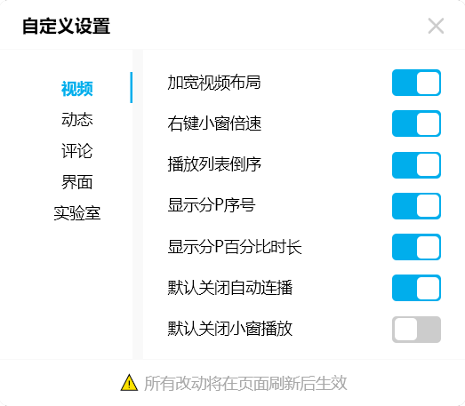

<div align="center">
  <h1>bilibili-userscript</h1>

  bilibili&thinsp;自用脚本
</div>

## 环境要求

- 浏览器：推荐使用 Chrome, Edge, Firefox 或 Opera（最好 Chrome/Edge >=105 、Firefox >=121 、Opera >=91 以支持`:has()`伪类）。
- 用户脚本管理器：推荐使用 [Tampermonkey](https://www.tampermonkey.net) 或 [Violentmonkey](https://violentmonkey.github.io)。

## 安装使用

请自行编译安装。

登录bilibili后打开任意B站页面，点击脚本管理器找到此脚本的“自定义设置”。

调整脚本设置后，刷新页面，改动生效。

## 功能特性

- 清理版面上的各种广告模块，统一各处滚动条的样式
- 简化评论区、直播间的多余元素
- 清除地址栏追踪参数
- 播放列表高度自适应
- 屏蔽带货营销、商家推广的动态
- 自动展开动态内容，禁止点击跳转，方便复制粘贴
- 快速收起评论，移除评论搜索词
- 以及更多功能……

## 设置界面

<center>



</center>

## 本地开发

### 克隆代码

```bash
git clone git@github.com:tiartrop/UserScript.git
```

### 安装依赖

```bash
npm install
```

### 编译打包

```bash
npm run build
```
完成之后可以在bilibili文件夹下的 `dist` 目录看到编译打包好的文件。

## 参考致谢

- [移除 Bilibili 链接垃圾参数](https://greasyfork.org/scripts/471831)
- [Bilibili - 在未登录的情况下照常加载评论](https://greasyfork.org/scripts/473498)
- [Bilibili-Evolved](https://github.com/the1812/Bilibili-Evolved)
- [MSCSTSTS-TOOLS](https://greasyfork.org/scripts/38220)
- [YAWF 药方](https://tiansh.github.io/yawf/)

## 开源许可

基于 [MIT license](https://opensource.org/licenses/MIT) 许可进行开源。
